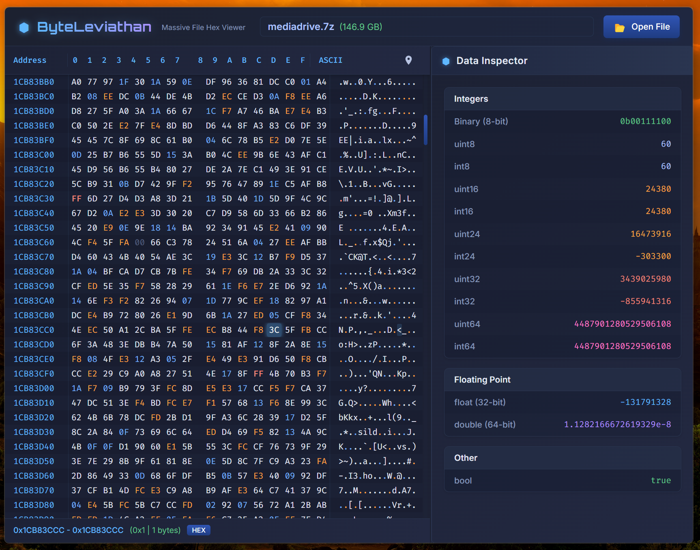

# ByteLeviathan

A lightweight hex editor capable of handling massive files with minimal memory usage.

Effortlessly browsing a 150 GB file while consuming 20 MB RAM:




## About

ByteLeviathan is a Tauri-based hex editor built with Rust and Svelte that can handle extremely large files (100GB+) while maintaining a tiny memory footprint. This was developed as a personal practice project for learning Rust and Svelte.

Installer file size 1.9 MB, executable size 9 MB.

## Features

- **Efficient memory usage** - Open and navigate 100GB+ files with minimal RAM consumption
- **Seamless navigation** - Smooth scrolling through giant files with virtually no lag
- **Data inspector** - View selected bytes as different data types (int8/16/32/64, float, etc.)
- **Keyboard navigation** - Arrow keys, Page Up/Down, Home/End for efficient movement
- **Multiple views** - Simultaneous hex and ASCII representation
- **Go to address** - Jump directly to specific byte locations

## License

This project is licensed under the Mozilla Public License 2.0 - see the LICENSE file for details.

```
Mozilla Public License Version 2.0
==================================

1. Definitions
-------------

1.1. "Contributor" means each individual or legal entity that creates, contributes to
    the creation of, or owns Covered Software.
    
...
```

